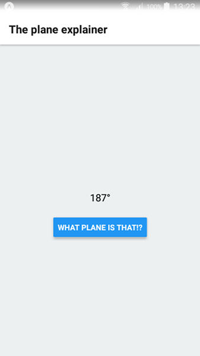
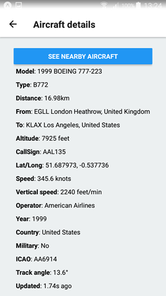
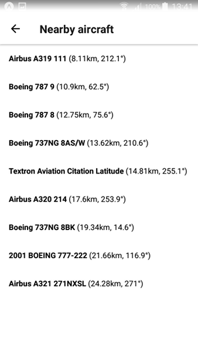

# The Plane Explainer

This is a React Native application that allows you to view information about an aircraft by pointing your device at it and pressing a button.

It works by sending your GPS coordinates to an API that returns realtime [ADBS](https://en.wikipedia.org/wiki/Automatic_dependent_surveillance_%E2%80%93_broadcast) information. Your phone then uses its compass bearing to calculate from this information which aircraft you were pointing at.

It consists of a client and a server.

## The server

The server forwards requests for local flight information to [ADSBexchange](https://public-api.adsbexchange.com/). It can be started as follows:

```
cd server
yarn && yarn start
```

You'll need to give your device access to this local endpoint. One way is to use a tool like [ngrok](https://ngrok.com/) to create a public URL. Remember this URL as we'll need it to configure the client.

## The client

The client was created using [Expo](https://expo.io/). To set up a development environment, you'll need to install the [Expo CLI and client](https://expo.io/tools).

You'll also need to configure the client to be aware of the server URL. This can be done in the **env.js** file.
```
  export const AIRCRAFT_SERVER_URL= 'SERVER URL GOES HERE';
```

The client can be started as follows:

```
cd client
yarn && yarn start
```

From the client directory, the tests can be run as follows:

```
yarn test
```




